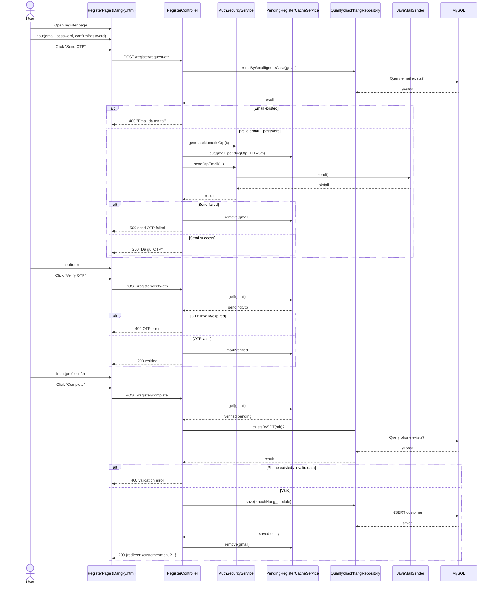

# Register OTP Flow

```mermaid
sequenceDiagram
actor U as User
participant RP as RegisterPage (Dangky.html)
participant RC as RegisterController
participant AS as AuthSecurityService
participant Cache as PendingRegisterCacheService
participant Repo as QuanlykhachhangRepository
participant Mail as JavaMailSender
participant DB as MySQL

    U->>RP: Open register page
    U->>RP: input(gmail, password, confirmPassword)
    U->>RP: Click "Send OTP"
    RP->>RC: POST /register/request-otp

    RC->>Repo: existsByGmailIgnoreCase(gmail)
    Repo->>DB: Query email exists?
    DB-->>Repo: yes/no
    Repo-->>RC: result

    alt Email existed
        RC-->>RP: 400 "Email da ton tai"
    else Valid email + password
        RC->>AS: generateNumericOtp(6)
        RC->>Cache: put(gmail, pendingOtp, TTL=5m)
        RC->>AS: sendOtpEmail(...)
        AS->>Mail: send()
        Mail-->>AS: ok/fail
        AS-->>RC: result
        alt Send failed
            RC->>Cache: remove(gmail)
            RC-->>RP: 500 send OTP failed
        else Send success
            RC-->>RP: 200 "Da gui OTP"
        end
    end

    U->>RP: input(otp)
    U->>RP: Click "Verify OTP"
    RP->>RC: POST /register/verify-otp
    RC->>Cache: get(gmail)
    Cache-->>RC: pendingOtp

    alt OTP invalid/expired
        RC-->>RP: 400 OTP error
    else OTP valid
        RC->>Cache: markVerified
        RC-->>RP: 200 verified
    end

    U->>RP: input(profile info)
    U->>RP: Click "Complete"
    RP->>RC: POST /register/complete
    RC->>Cache: get(gmail)
    Cache-->>RC: verified pending
    RC->>Repo: existsBySDT(sdt)?
    Repo->>DB: Query phone exists?
    DB-->>Repo: yes/no
    Repo-->>RC: result

    alt Phone existed / invalid data
        RC-->>RP: 400 validation error
    else Valid
        RC->>Repo: save(KhachHang_module)
        Repo->>DB: INSERT customer
        DB-->>Repo: saved
        Repo-->>RC: saved entity
        RC->>Cache: remove(gmail)
        RC-->>RP: 200 {redirect: /customer/menu?...}
    end
```
